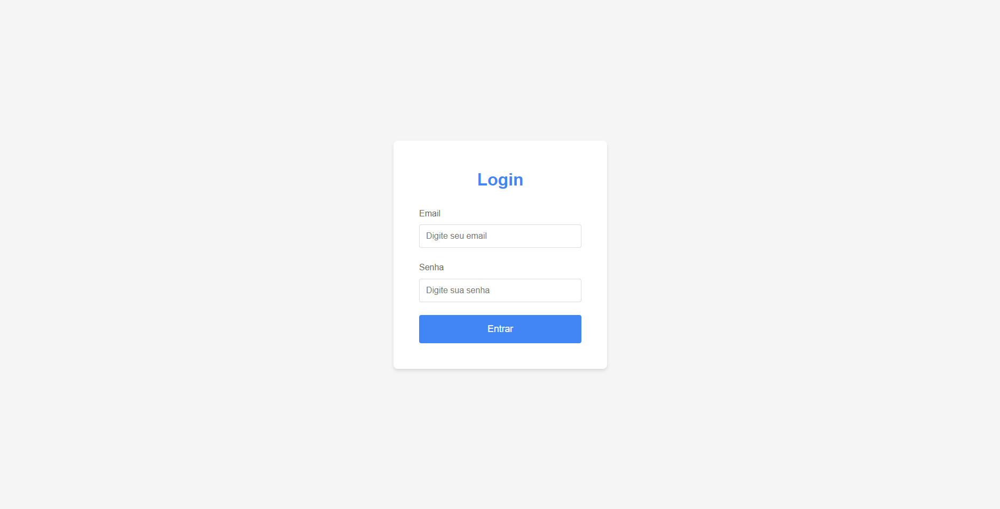
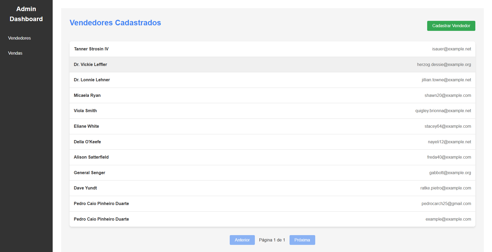
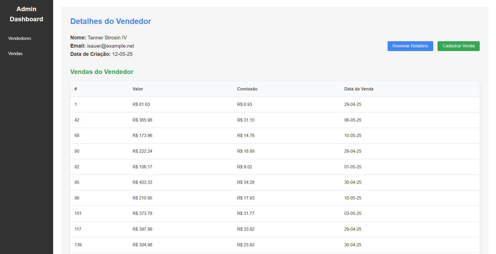
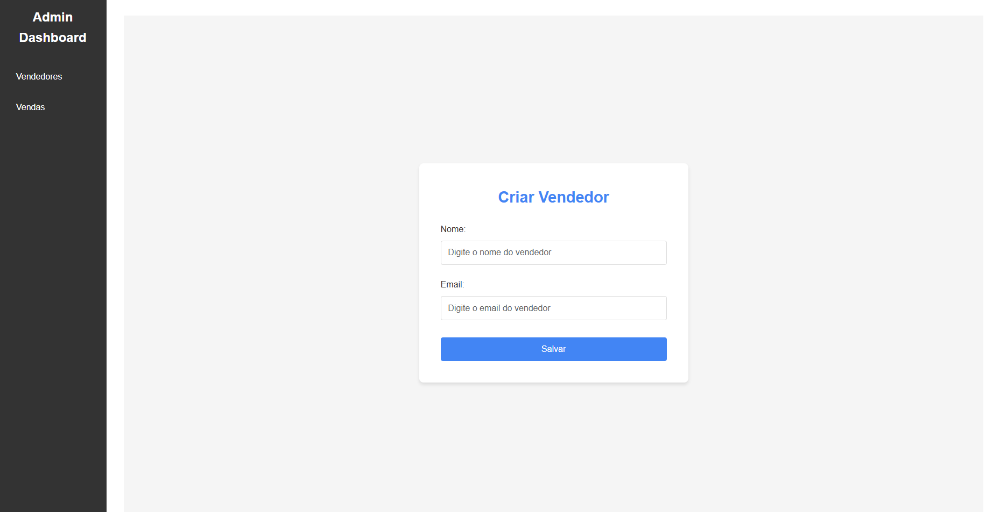
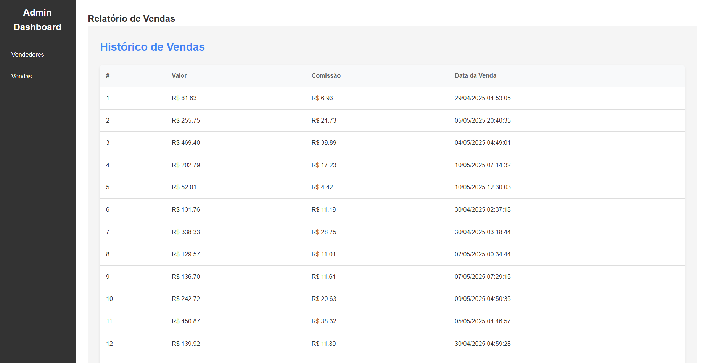
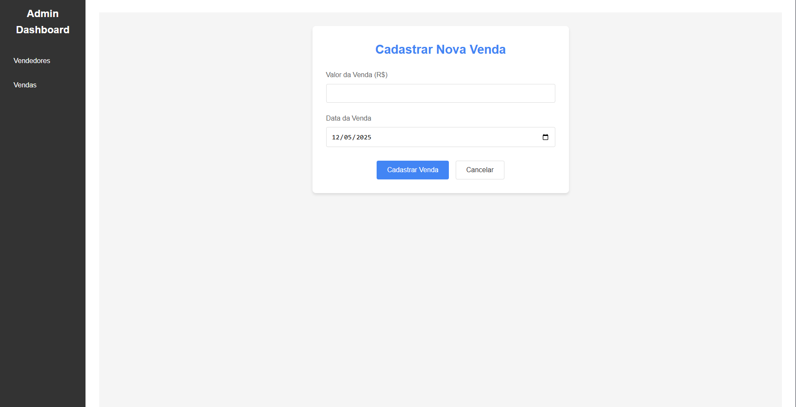

# Desafio tray de vendas e comissões - Frontend

## Instalação

### Pré-requisitos

- Docker and Docker Compose instalados

### Configuração

1. **Clone o repositório**
   ```bash
   git clone https://github.com/PCDuarte25/tray-comissions-challenge-frontend.git
   cd tray-comissions-challenge-frontend
   ```

2. **Crie um arquivo `.env` baseado no `.env.example`**
    ```bash
    cp .env.example .env
    ```

3. **Configure a URL da API no `.env`**
    ```bash
    VITE_API_URL=http://localhost:9000
    ```

### Execução do projeto
1. **Inicie os containers**
   ```bash
   docker-compose up -d --build
   ```

2. **Acesse a aplicação pela URL http://localhost:3000.**

## Rotas da aplicação

* Login para usuário admin já pré definido no banco: `http://localhost:3000/` ou `http://localhost:3000/login`
   ```bash
   email: joaosilva@example.com
   senha: joaosilva123
   ```
* Dashboard de vendedores que mostra a listagem de todos vendedores: `http://localhost:3000/dashboard/vendedores`
* Visualização canônica de vendedor: `http://localhost:3000/dashboard/vendedores/{id}`
* Cadastro de vendedor: `http://localhost:3000/dashboard/criar-vendedor`
* Dashboard de vendas que mostra a listagem de todas as vendas: `http://localhost:3000/dashboard/vendas`
* Cadastro de venda: `http://localhost:3000/dashboard/vendedores/{id}/cadastrar-venda`

### Como ficou
<details>
<summary>Tela de login</summary>

</details>
<details>
<summary>Dashboard vendedores</summary>

</details>
<details>
<summary>Visualização de vendedor</summary>

</details>
<details>
<summary>Cadastro de vendedor</summary>

</details>
<details>
<summary>Dashboard de vendas</summary>

</details>
<details>
<summary>Cadastro de venda</summary>

</details>

